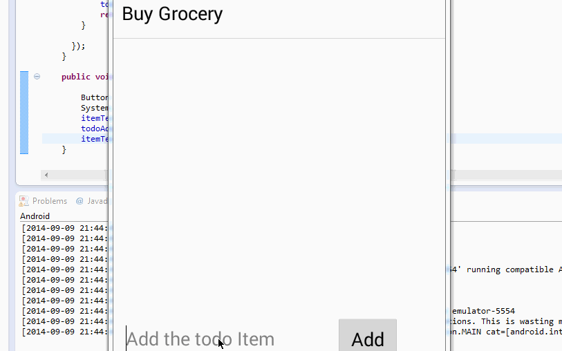

AndroidSimpleToDoApp
====================

It's Simple Todo App Developed in Android.

This is an Android demo application for simple todo list. 

Time spent: 2 hours spent in total

Completed user stories:
 Required: User can add an item to the todo Item list
 Required: User can also delete an Item from the Todo list by long click.
 
Notes:
Spent some time making the UI work across multiple phone resolutions by playing around with the RelativeLayout.

Walkthrough of all user stories:

GIF created with [LiceCap](http://www.cockos.com/licecap/).
